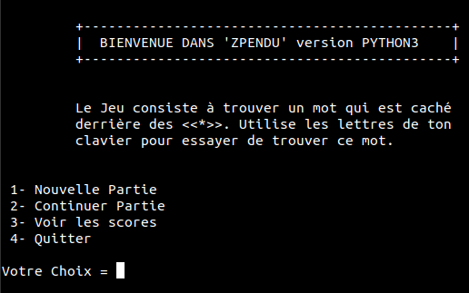

# ZPendu 🔎🧠😋
Try to <strong>find the hidden word</strong> with a trial limit number.  
  
After select <strong>option 2</strong> :  

## How to use ?
<ul>
  <li> run <strong>python3 ZPendy.py</strong> </li>
</ul>
